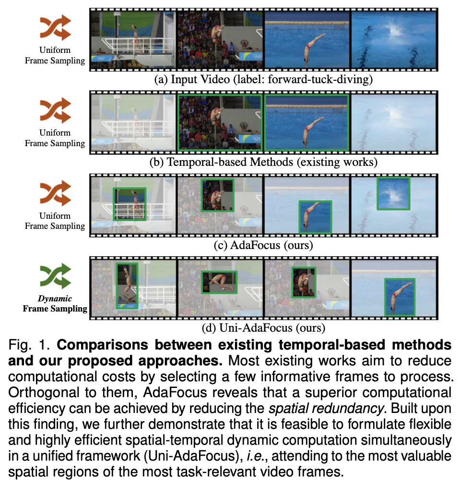
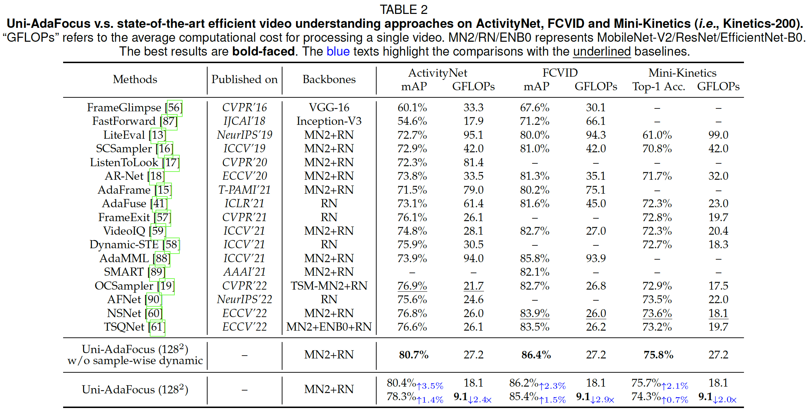
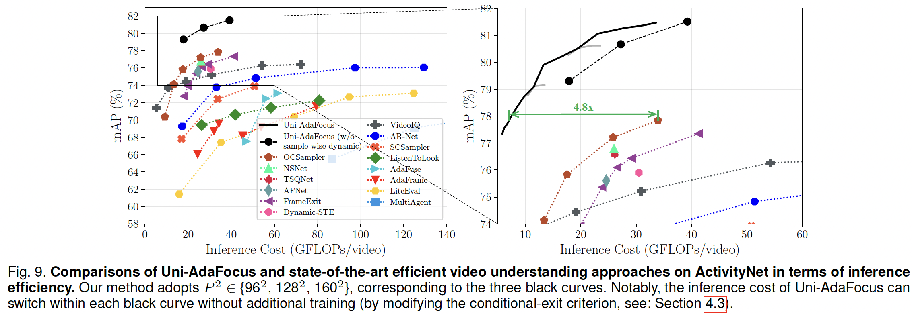
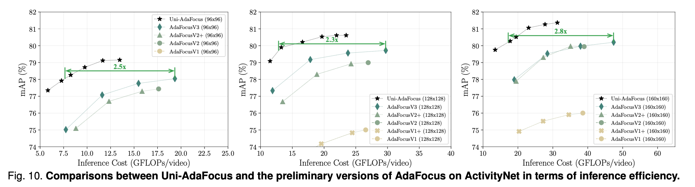
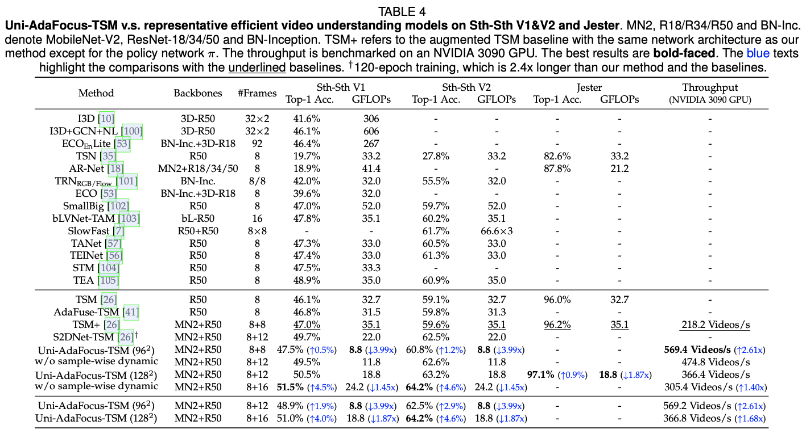
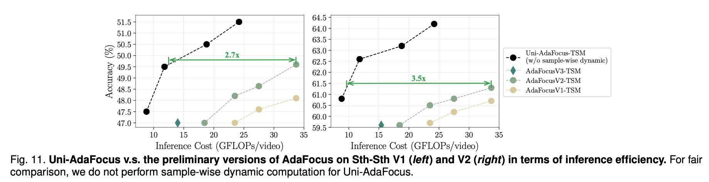
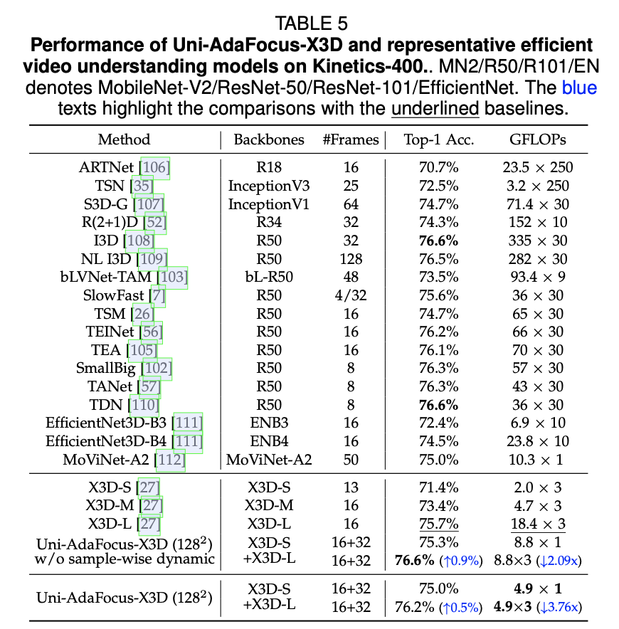
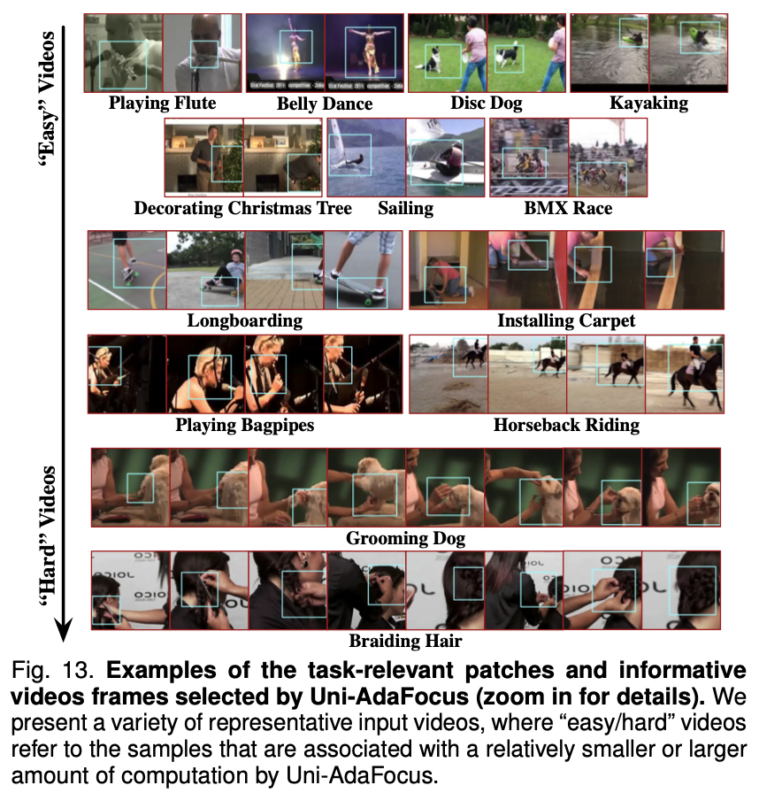
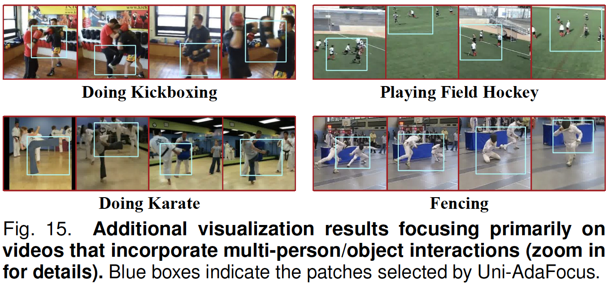
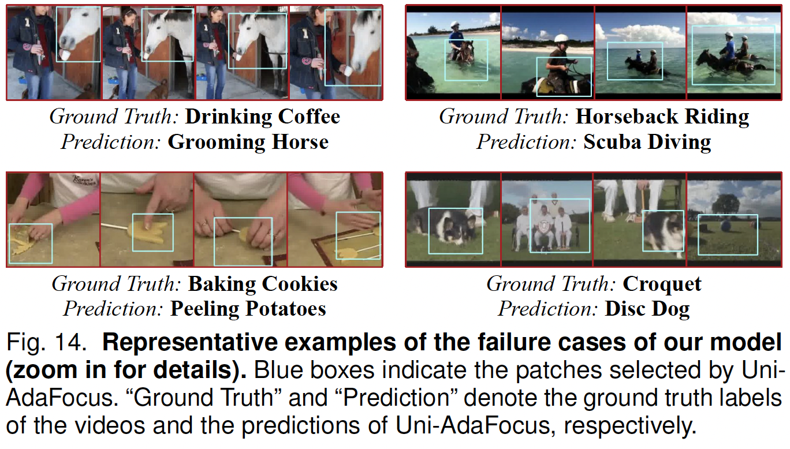

# Uni-AdaFocus (TPAMI'24 & ICCV'21/CVPR'22/ECCV'22)

This repo contains the official code and pre-trained models for "Uni-AdaFocus: Spatial-temporal Dynamic Computation for Video Recognition". 

Uni-AdaFocus is the latest version of the AdaFocus series.

- [TPAMI 2024]
[Uni-AdaFocus: Spatial-Temporal Dynamic Computation for Video Recognition]()
- [ECCV 2022]
[AdaFocus V3: On Unified Spatial-temporal Dynamic Video Recognition](https://arxiv.org/pdf/2209.13465.pdf)
- [CVPR 2022]
[AdaFocus V2: End-to-End Training of Spatial Dynamic Networks for Video Recognition](https://arxiv.org/pdf/2112.14238.pdf)
- [ICCV 2021]
[Adaptive Focus for Efficient Video Recognition](https://arxiv.org/pdf/2105.03245.pdf)


## Contents
- [Introduction](#introduction)
- [Get Started](#get-started)
- [Results](#results)
- [Reference](#reference)
- [Contact](#contact)

## Introduction

We explore the phenomenon of **spatial redundancy**, **temporal redundancy** and **sample-wise redundancy** in video understanding and propose Uni-AdaFocus, an efficient end-to-end video recognition framework.
Uni-AdaFocus is built on top of AdaFocus, which employs a lightweight encoder and policy network to identify and process the most informative spatial regions in each video frame. 
Uni-AdaFocus extends AdaFocus by dynamically allocating computation to the most task-relevant frames and minimizing the computational resources spent on easier videos. Uni-AdaFocus is compatible with off-the-shelf efficient backbones (e.g. TSM and X3D), and can markedly improve their inference efficiency. 
Extensive experiments on seven benchmark datasets (i.e, ActivityNet, FCVID, Mini-Kinetics, Something-Something V1&V2, Jester, and Kinetics-400) and three real-world application scenarios (i.e, fine-grained diving action classification, Alzheimer's and Parkinson's diseases diagnosis with brain magnetic resonance images (MRI), and violence recognition for online videos) substantiate that Uni-AdaFocus is considerably more efficient than the competitive baselines.

<p align="center">
    
</p>

## Get Started

For reproducing our experimental results, please go to following folders for specific instructions:
* [Uni-AdaFocus with Experiments on ActivityNet, FCVID and Mini-Kinetics](Uni-AdaFocus%20with%20Experiments%20on%20ActivityNet,%20FCVID%20and%20Mini-Kinetics) 
* [Uni-AdaFocus-TSM with Experiments on Sth-Sth V1&V2 and Jester](Uni-AdaFocus-TSM%20with%20Experiments%20on%20Sth-Sth%20V1&V2%20and%20Jester) 
* [Uni-AdaFocus-X3D with Experiments on Kinetics-400](Uni-AdaFocus-X3D%20with%20Experiments%20on%20Kinetics-400)

For applying Uni-AdaFocus to your own tasks, check this tutorial:
* Uni-AdaFocus for long videos (longer than 10s): [custom_finetune.md](Uni-AdaFocus%20with%20Experiments%20on%20ActivityNet,%20FCVID%20and%20Mini-Kinetics/custom_finetune.md)
* Uni-AdaFocus-TSM for short videos (shorter than 10s): [custom_finetune_TSM.md](Uni-AdaFocus-TSM%20with%20Experiments%20on%20Sth-Sth%20V1&V2%20and%20Jester/custom_finetune_TSM.md)

## Results

- Performance (mAP, GFLOPs) on ActivityNet, FCVID and Mini-Kinetics

<p align="center">
    
</p>

- Inference efficiency (mAP v.s. GFLOPs) on ActivityNet

<p align="center">
    
</p>

- Inference efficiency (mAP v.s. GFLOPs) of Uni-AdaFocus and the preliminary versions of AdaFocus on ActivityNet

<p align="center">
    
</p>


- Performance (Acc., GFLOPs) on Something-Something V1&V2 and Jester

<p align="center">
    
</p>

- Inference efficiency (Acc. v.s. GFLOPs) of Uni-AdaFocus and the preliminary versions of AdaFocus on Something-Something V1&V2

<p align="center">
    
</p>


- Performance (Acc., GFLOPs) on Kinetics-400

<p align="center">
    
</p>


- Visualization of the selected informative frames and patches

<p align="center">
    
</p>

<p align="center">
    
</p>

- Visualization of failure cases

<p align="center">
    
</p>

## Reference
If you find our code or papers useful for your research, please cite:
```
@article{wang2024uniadafocus,
     title = {Uni-AdaFocus: Spatial-temporal Dynamic Computation for Video Recognition},
    author = {Wang, Yulin and Zhang, Haoji and Yue, Yang and Song, Shiji and Deng, Chao and Feng, Junlan and Huang, Gao},
   journal = {IEEE Transactions on Pattern Analysis and Machine Intelligence (TPAMI)},
      year = {2024},
}

@inproceedings{wang2021adafocus,
     title = {Adaptive Focus for Efficient Video Recognition},
    author = {Wang, Yulin and Chen, Zhaoxi and Jiang, Haojun and Song, Shiji and Han, Yizeng and Huang, Gao},
 booktitle = {Proceedings of the IEEE/CVF International Conference on Computer Vision (ICCV)},
      year = {2021}
}

@inproceedings{wang2022adafocusv2,
     title = {AdaFocus V2: End-to-End Training of Spatial Dynamic Networks for Video Recognition},
    author = {Wang, Yulin and Yue, Yang and Lin, Yuanze and Jiang, Haojun and Lai, Zihang and Kulikov, Victor and Orlov, Nikita and Shi, Humphrey and Huang, Gao},
 booktitle = {Proceedings of the IEEE/CVF Conference on Computer Vision and Pattern Recognition (CVPR)},
      year = {2022}
}

@inproceedings{wang2022adafocusv3,
     title = {AdaFocusV3: On Unified Spatial-temporal Dynamic Video Recognition},
    author = {Wang, Yulin and Yue, Yang and Xu, Xinhong and Hassani, Ali and Kulikov, Victor and Orlov, Nikita and Song, Shiji and Shi, Humphrey and Huang, Gao},
 booktitle = {European Conference on Computer Vision (ECCV)},
      year = {2022},
}
```

## Contact
If you have any question, feel free to contact the authors or raise an issue. 

Yulin Wang: wang-yl19@mails.tsinghua.edu.cn

Haoji Zhang: zhj24@mails.tsinghua.edu.cn 
